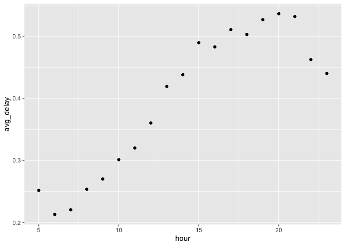
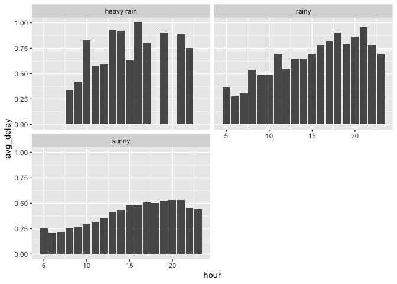
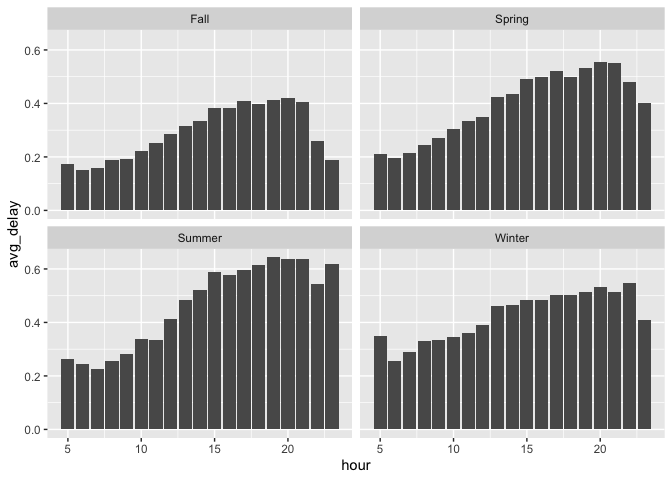
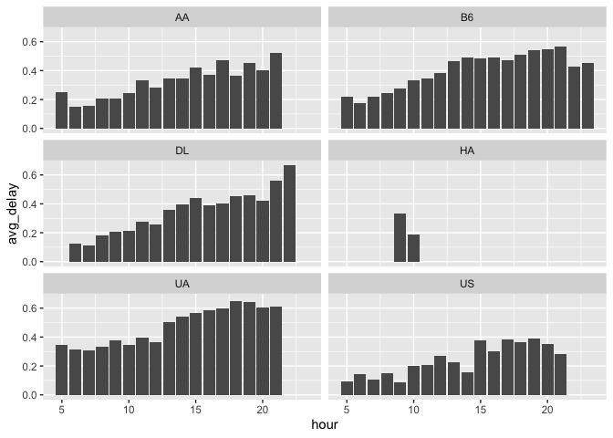

Stat433 HW 3
================
Xingjian Yan
3/1/2021

\#\#\#\#\#I am interested in what time of day should you fly if you want
to avoid delays as much as possible? Thus, I analyzed the database,
“nycflights13”, to answer this question. The figure below shows that the
best time to take a flight is from 6 am to 7 am. Because the average
delay time at these hours is relatively short. In addition, I found that
precipitation is positively correlated with the length of delays; spring
and summer have longer average delay times; different airlines have
different delay lengths.

<!-- -->

\#\#\#\#\#\#Here I created three new levels for precipitation data in
“weather”. When precipitation is &lt;= 0.1 in, it’s a sunny day. When
precipitation is &gt; 0.1 and &lt;= 0.4, it’s a rainy day. When
precipitation is &gt; 0.4, it’s a heavy rainy day. By looking at the
three graphs, we could still conclude that the best time to take a
flight is from 6 am to 7 am. However, with rainy and heavy rainy days,
the average delay time is much longer, which is pretty intuitive.

<!-- -->

\#\#\#\#\#\#Figures below are average delay time vs hours in four
different seasons. From the graphs, spring and summer have longer delay
time than fall and winter; the patterns in fall and spring are pretty
similar to the original scatter plot (i.e. hours vs avg\_delay), while
winter has a fairly constant delay length among 5 am-12 am and 13 pm-23
pm. We could tell that summer is the most special one because it has the
longest average delay time. I think this is because people tend to
travel more in summer. Thus, busier airports lead to longer delay times.

<!-- -->

\#\#\#\#\#\#Here I analyzed the effect of airlines on the average delay
time. In order to produce better figures, I picked 6 large airlines to
evaluate the effect. Five of the six airlines have similar patterns
compared to the original graph (i.e. the length of delay increases as
the hour of a day increases). However, HA airline is a unique case – it
has delays only at 9 am and 10 am. There are two explanations: 1. HA is
doing a very good job to keep their flights on time; 2. we lack enough
data for HA airline. I think the second one might be the case here.
Overall, US airline seems to do a better job of keeping flights on time.

<!-- -->
